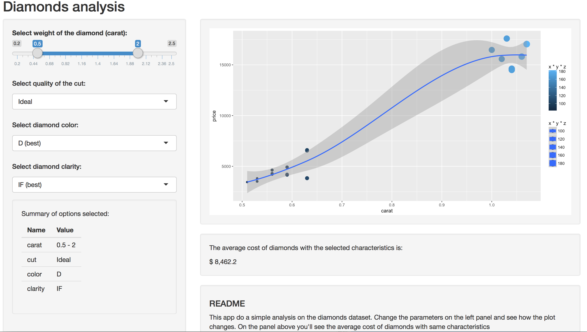

DSS - DDP: Final Project
========================================================
author: Rocio Elizalde

date: April 9th, 2017

Diamonds Dataset
========================================================

For this Shiny Application we'll use the diamonds dataset that contains the prices and other attributes of almost 54,000 diamonds. The variables that we'll use are as follows:

- __price__: price in US dollars (\$326-\$18,823)
- __carat__: weight of the diamond (0.2-5.01)
- __cut__: quality of the cut (Fair, Good, Very Good, Premium, Ideal)
- __color__: diamond colour, from J (worst) to D (best)
- __clarity__: a measurement of how clear the diamond is (I1 (worst), SI1, SI2, VS1, VS2, VVS1, VVS2, IF (best))

More details can be found at <http://ggplot2.tidyverse.org/reference/diamonds.html>.

Shiny Application
========================================================

The Application consists on 4 panels as follows:

- A sidebar panel where the user can select the characteristics of the diamons needed.
- A plot panel where the user can see the relation between the price and carat and the characteristics selected.
- A panel where the average price is shown for those settings
- A README panel where it's explained the use of this simple app.

Application
========================================================

